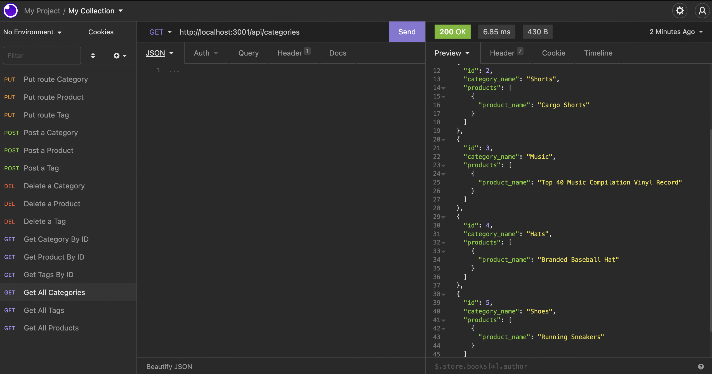

# E-Commerce-Backend

[License](https://img.shields.io/static/v1?label=License&message=MIT&color=blueviolet&style=plastic)

## Table of contents:

- [Description](#description)
- [Installation](#installation-and-Usage)
- [Contributors](#contributors)
- [Questions](#questions)

### Description:

This is a back end for an ecommerce site. I setup an Express REST API connected to a MySQL database using Sequelize, an ORM that allows developers to interact with SQL databases using Javascript. The user can modify, create, or delete all the objects in the Ecommerce app including products, tags, and categories.

screenshots of running program: 

### Installation and Usage:

The only thing you need to run this program is node package manager! Run 'npm i' in the command line to install all the necessary dependencies. Then run your mysql database with 'mysql -u root -p' and input your password. Next type 'source db/schema.sql' and exit the mysql program. Lastly you want to initiate the program by typing 'npm start' and you can now create, modify, or delete anything you want in the ecommerce store using Insomnia or Postman!

### License:

This project is licensed under: MIT

### Contributors:

Abdirahman

### Questions:

If you have any questions contact Abdirahman on [Github](https://github.com/aden-abdirahman)
or [Email](https://aden.abdirahman45@gmail.com)

Link to video walkthrough: [video](https://drive.google.com/file/d/1hy9zxOry-hd6HKtFzFKzCs8mOv8B0LLL/view?usp=sharing)
